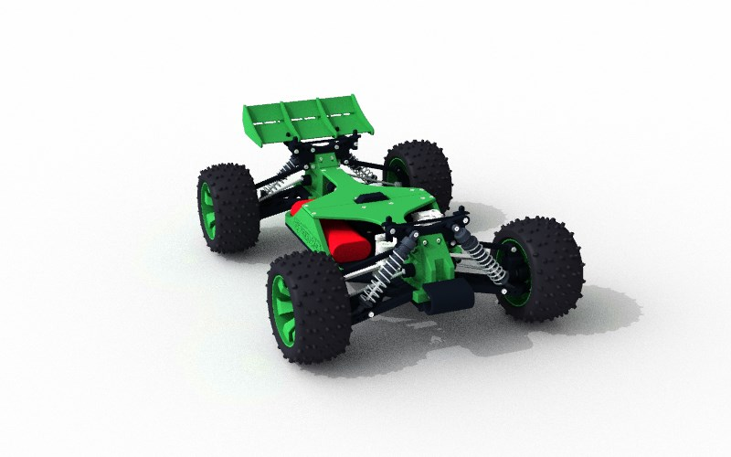
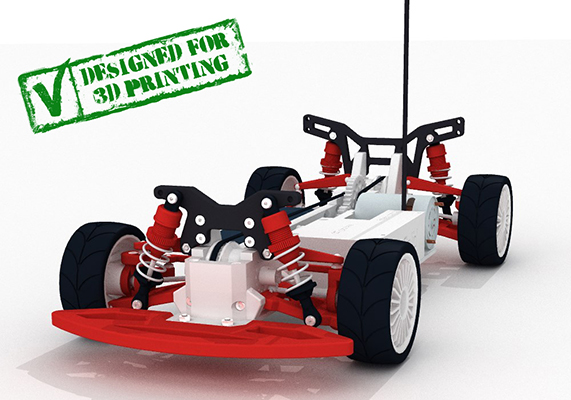
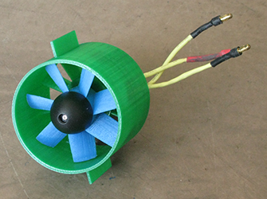

Repo for the OpenRC Printable Radio Controlled Vehicles Project. Contains printable parts, instructions, and parts sourcing info. Based on the [Google Group here](https://plus.google.com/communities/112745535856143176146)

# [General RC Information](RCInfo.md)
Battery info, radio info, etc.

# Projects

## [Truggy](Truggy)

An awesome 4WD 1:10 Scale 3D printable truggy! This pic says all about this sexy beast:

## [Touring Car](https://github.com/bryancostanich/OpenRC/tree/master/Touring_Car)

4WD 1:10 scale 3D Printable touring car. Also designed by Daniel, the Touring Car was his first attempt at designing an RC Car.

## [Ducted Fan Design Library](DuctedFanDesignLibrary)

An electric ducted fan design library written in Python using the Blender API. Currently, the software is in script form, but an add-on of sorts is being created.

## Authors
 * Truggy - Daniel Norée
 * Ducted Fan Design Library - André Roy
